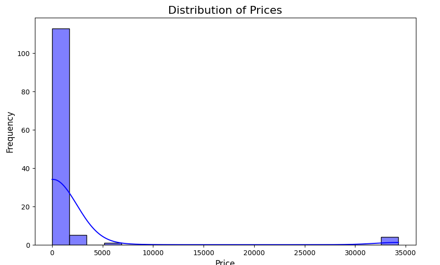

# Streaming-cryptocurrency-price-data-from-Binance

# Project Overview
This project is designed to stream cryptocurrency price data from Binance via an API, process the data using Apache Kafka and PyFlink, and visualize the processed results using Python libraries like Matplotlib and Seaborn.

The flow is as follows:

1. **Kafka Producer**: Collects real-time data from the Binance API and sends it to a Kafka topic.
2. **Kafka Consumer with PyFlink**: Consumes the data from the Kafka topic, processes it with PyFlink, and stores the results in a CSV file.
3. **Data Visualization**: Loads the processed data from the CSV file and creates visualizations (histograms, bar plots, time-series trends, etc.).

This system requires a few prerequisites and setup steps for Kafka, PyFlink, and other dependencies.

---

## Requirements
To run this project, ensure you have the following Python version and libraries installed:

- **Python 3.9 or 3.10** (due to compatibility with libraries like PyFlink)
- **Apache Kafka** (for the messaging system)
- **PyFlink** (for stream processing)
- **Other Python Libraries**:
  - requests
  - json
  - pandas
  - matplotlib
  - seaborn
  - time
  - csv
  - os

You can install the required Python libraries using the following command:

```bash
pip install -r requirements.txt
```


---

## Step-by-Step Setup and Execution

### 1. Install Apache Kafka
To use Kafka, you need to have it installed on your local machine or use a cloud-based service.

**On Local Machine (Kafka Setup):**

1. Start Zookeeper (required for Kafka):

   ```bash
   bin/zookeeper-server-start.sh config/zookeeper.properties
   ```
2. Start Kafka server:

   ```bash
   bin/kafka-server-start.sh config/server.properties
   ```

### 2. Run the Kafka Producer
The Kafka producer script fetches live cryptocurrency data from Binance API and pushes the data to the Kafka topic (`test`).

**To run the Kafka producer:**

1. Open a terminal and navigate to your project directory.
2. Execute the producer script:

   ```bash
   python kafka_producer.py
   ```

This will continuously fetch data from the Binance API every 5 seconds and push it to the Kafka `test` topic.

### 3. Run the Kafka Consumer with PyFlink
The PyFlink consumer script consumes data from the Kafka `test` topic, processes the data, and writes it to a CSV file.

**To run the PyFlink consumer:**

1. Open a terminal and navigate to your project directory.
2. Execute the PyFlink consumer script:

   ```bash
   python kafka_flink_consumer.py
   ```

The data will be processed and saved in `financial_data.csv`. The script uses a sliding window (10 minutes with a slide every 1 minute) to process the data.

### 4. Data Visualization
Once the data is written to `financial_data.csv`, you can generate visualizations. Run the following Python script to create charts and plots:

```bash
python visualize_data.py
```

The following visualizations will be generated:

- **Distribution of Prices**: A histogram and KDE plot showing the distribution of cryptocurrency prices.
- **Top 10 Symbols by Price**: A bar plot for the top 10 symbols with the highest prices.
- **Price Trend for a Specific Symbol**: A line plot showing the price trend for a specific symbol over time.
- **Price Distribution by Symbol**: A boxplot to visualize the distribution of prices for each symbol.
- **Time-Series Price Trends for Top Symbols**: A multi-line plot showing price trends for the top 5 symbols.

### 5. Cleanup
To remove the generated CSV file after processing, run the following command:

```bash
rm financial_data.csv
```

---

## How the Code Works

### Kafka Producer (`kafka_producer.py`)
This part of the code continuously fetches cryptocurrency prices from the Binance API and sends them to Kafka:

- `KafkaProducer` is configured to connect to `localhost:9092`.
- The producer serializes the data (as JSON) and sends it to the Kafka `test` topic.
- The API requests the price for each trading pair in real-time, and the data is sent to Kafka in 5-second intervals.

### Kafka Consumer with PyFlink (`kafka_flink_consumer.py`)
The consumer listens to the `test` Kafka topic:

- `FlinkKafkaConsumer` consumes messages from Kafka.
- The messages are parsed from JSON into Python dictionaries.
- A sliding window of 10 minutes is applied, and every minute the data is processed.
- The processed data is saved in the `financial_data.csv` file.

### Data Visualization (`visualize_data.py`)
This script reads the `financial_data.csv` file into a Pandas DataFrame and generates various plots:

- **Histogram and KDE** to show the price distribution.
- **Bar plot** to display the top 10 symbols with the highest prices.
- **Line plot** showing price trends for a selected symbol.
- **Boxplot** to illustrate the price distribution across different symbols.
- **Multiple time-series plots** for the top 5 symbols with the highest average price.

---

## Troubleshooting

- **Kafka Connection Issues**: Ensure Kafka is running locally and that the producer and consumer scripts are pointing to the correct Kafka server (`localhost:9092`).
- **Library Errors**: Make sure you're using Python 3.9 or 3.10, as certain libraries such as PyFlink may not be compatible with other versions.

---

## Conclusion
This project integrates Kafka, PyFlink, and Python libraries to process and visualize real-time cryptocurrency price data. The steps outlined will allow you to set up Kafka locally, stream data, process it, and generate meaningful insights using visualizations.

---

## Screenshots of Visualizations

**Price Distribution**: 

**Top 10 Symbols by Price**: 

**Price Trend for Symbol**: 

**Price Distribution by Symbol**: 


---

**End of README**

This README provides a complete overview, including the steps to install, run, and troubleshoot the project. Include the necessary visualizations (screenshots) in the `images/` folder and ensure the instructions are followed for a smooth execution of the project.


